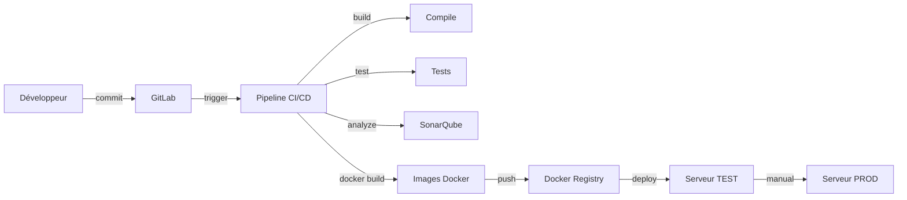

# CI/CD Scripts et Configuration

Ce dossier contient tous les scripts et configurations nécessaires pour le pipeline CI/CD DAOS.

## Contenu du Dossier

```
ci-cd/
├── README.md                        # Ce fichier
├── docker-compose-sonarqube.yml     # SonarQube avec PostgreSQL
├── init-sonarqube.sh                # Script d'initialisation SonarQube
├── deploy-test.sh                   # Script de déploiement TEST
├── deploy-prod.sh                   # Script de déploiement PRODUCTION
└── gitlab-ci-variables.md           # Documentation des variables GitLab CI
```

## Quick Start

### 1. Démarrer SonarQube

```bash
cd ci-cd

# Démarrer SonarQube et PostgreSQL
docker-compose -f docker-compose-sonarqube.yml up -d

# Vérifier les logs
docker logs -f daos-sonarqube

# Attendre que SonarQube soit prêt (2-3 minutes)
# Accès: http://localhost:9000
# Login initial: admin / admin
```

### 2. Initialiser SonarQube

```bash
# Rendre le script exécutable
chmod +x init-sonarqube.sh

# Exécuter l'initialisation
./init-sonarqube.sh

# Le script va:
# - Changer le mot de passe admin
# - Créer un token pour GitLab CI
# - Créer tous les projets DAOS
# - Configurer les Quality Gates
```

**Sauvegarder le token généré!** Vous en aurez besoin pour la variable `SONAR_TOKEN` dans GitLab CI.

### 3. Configurer les Variables GitLab

Voir [gitlab-ci-variables.md](gitlab-ci-variables.md) pour la liste complète.

Variables minimales:
```bash
SONAR_HOST_URL=http://votre-ip:9000
SONAR_TOKEN=<token généré par init-sonarqube.sh>
TEST_SERVER_HOST=10.0.2.50
TEST_SERVER_USER=deploy
SSH_PRIVATE_KEY=<contenu clé privée SSH>
```

### 4. Préparer les Serveurs de Déploiement

**Sur chaque serveur (TEST et PROD):**

```bash
# Installer Docker
curl -fsSL https://get.docker.com -o get-docker.sh
sudo sh get-docker.sh

# Installer Docker Compose
sudo curl -L "https://github.com/docker/compose/releases/download/v2.23.0/docker-compose-$(uname -s)-$(uname -m)" -o /usr/local/bin/docker-compose
sudo chmod +x /usr/local/bin/docker-compose

# Créer l'utilisateur de déploiement
sudo useradd -m -s /bin/bash deploy
sudo usermod -aG docker deploy

# Créer le répertoire DAOS
sudo mkdir -p /opt/daos
sudo chown deploy:deploy /opt/daos

# Configurer SSH pour l'utilisateur deploy
sudo su - deploy
mkdir ~/.ssh
chmod 700 ~/.ssh
# Ajouter la clé publique correspondant à SSH_PRIVATE_KEY
nano ~/.ssh/authorized_keys
chmod 600 ~/.ssh/authorized_keys
```

**Copier les fichiers nécessaires:**

```bash
# Depuis votre machine locale
scp ../docker-compose.yml deploy@serveur-test:/opt/daos/
scp ../.env.example deploy@serveur-test:/opt/daos/.env
scp deploy-test.sh deploy@serveur-test:/opt/daos/

# Éditer .env sur le serveur
ssh deploy@serveur-test
cd /opt/daos
nano .env
# Configurer les variables d'environnement
```

### 5. Tester le Déploiement Manuellement

**Sur le serveur TEST:**

```bash
ssh deploy@serveur-test
cd /opt/daos

# Rendre le script exécutable
chmod +x deploy-test.sh

# Exécuter le déploiement
./deploy-test.sh

# Le script va:
# - Vérifier les prérequis
# - Créer une sauvegarde
# - Arrêter les anciens services
# - Démarrer les nouveaux services
# - Effectuer des health checks
# - Rollback automatique si échec
```

---

## Scripts

### docker-compose-sonarqube.yml

Docker Compose pour SonarQube standalone avec PostgreSQL.

**Services:**
- `sonarqube`: SonarQube Community Edition 10.3
- `sonarqube-db`: PostgreSQL 15

**Ports:**
- 9000: Interface web SonarQube

**Volumes:**
- `sonarqube_data`: Données SonarQube
- `sonarqube_extensions`: Plugins SonarQube
- `sonarqube_logs`: Logs SonarQube
- `sonarqube_db`: Base de données PostgreSQL

**Commandes:**

```bash
# Démarrer
docker-compose -f docker-compose-sonarqube.yml up -d

# Arrêter
docker-compose -f docker-compose-sonarqube.yml down

# Voir les logs
docker-compose -f docker-compose-sonarqube.yml logs -f

# Nettoyer complètement
docker-compose -f docker-compose-sonarqube.yml down -v
```

### init-sonarqube.sh

Script d'initialisation et configuration de SonarQube.

**Fonctionnalités:**
- Attend que SonarQube soit prêt
- Change le mot de passe admin par défaut
- Génère un token d'authentification pour GitLab CI
- Crée tous les projets DAOS (10 projets)
- Configure les Quality Gates personnalisés
- Affiche les informations de connexion

**Variables d'environnement:**
- `SONAR_HOST_URL`: URL de SonarQube (défaut: http://localhost:9000)
- `SONAR_ADMIN_USER`: Username admin (défaut: admin)
- `SONAR_ADMIN_PASS`: Mot de passe admin (défaut: admin)

**Usage:**

```bash
# Avec les valeurs par défaut
./init-sonarqube.sh

# Avec des valeurs personnalisées
SONAR_HOST_URL=http://10.0.1.50:9000 \
SONAR_ADMIN_PASS=my-secure-password \
./init-sonarqube.sh
```

**Sortie:**
```
========================================
   INITIALISATION DE SONARQUBE
========================================

✓ SonarQube est prêt
✓ Mot de passe administrateur changé
✓ Token créé avec succès

IMPORTANT: Sauvegardez ce token dans les variables GitLab CI
Variable: SONAR_TOKEN
Valeur: squ_xxxxxxxxxxxxxxxxxxxxxxxxxx

✓ Projet Config Server créé
✓ Projet Eureka Server créé
...
✓ Quality Gate configuré

========================================
   SONARQUBE INITIALISÉ AVEC SUCCÈS
========================================
```

### deploy-test.sh

Script de déploiement automatique pour l'environnement TEST.

**Fonctionnalités:**
1. Vérification des prérequis (Docker, Docker Compose)
2. Création de sauvegarde (état conteneurs, .env)
3. Arrêt des services actuels
4. Pull des nouvelles images Docker depuis le registry
5. Nettoyage des anciennes images
6. Démarrage des nouveaux services
7. Health checks sur tous les services critiques
8. Rollback automatique en cas d'échec

**Variables d'environnement:**
- `DEPLOY_DIR`: Répertoire de déploiement (défaut: /opt/daos)
- `BACKUP_DIR`: Répertoire de sauvegarde (défaut: /opt/daos/backups)
- `CI_REGISTRY_PASSWORD`: Mot de passe Docker Registry
- `CI_REGISTRY_USER`: Username Docker Registry
- `CI_REGISTRY`: URL Docker Registry

**Usage:**

```bash
# Déploiement manuel
./deploy-test.sh

# Via GitLab CI (automatique)
# Le script est appelé par le job deploy:test
```

**Logs:**
- Console: Sortie colorée en temps réel
- Fichier: `/var/log/daos-deploy.log`

### deploy-prod.sh

Script de déploiement automatique pour l'environnement PRODUCTION.

**Fonctionnalités supplémentaires par rapport à deploy-test.sh:**
1. Confirmation manuelle obligatoire
2. Vérification de l'espace disque (minimum 10GB)
3. Sauvegarde complète de MySQL
4. Rolling update sans downtime (mise à jour progressive)
5. Smoke tests complets après déploiement
6. Surveillance post-déploiement (5 minutes)
7. Nettoyage des anciennes sauvegardes (garde les 10 dernières)
8. Rollback complet (incluant MySQL) en cas d'échec

**Variables d'environnement:**
- `DEPLOY_DIR`: Répertoire de déploiement (défaut: /opt/daos)
- `BACKUP_DIR`: Répertoire de sauvegarde (défaut: /opt/daos/backups)
- `CI_REGISTRY_PASSWORD`: Mot de passe Docker Registry
- `CI_REGISTRY_USER`: Username Docker Registry
- `CI_REGISTRY`: URL Docker Registry
- `CI`: Si défini, skip la confirmation manuelle (pour CI/CD)

**Usage:**

```bash
# Déploiement manuel (confirmation requise)
./deploy-prod.sh

# Via GitLab CI (pas de confirmation)
CI=true ./deploy-prod.sh
```

**Logs:**
- Console: Sortie colorée en temps réel
- Fichier: `/var/log/daos-deploy-prod.log`

**Sauvegardes créées:**
```
/opt/daos/backups/
├── backup-20231225-143000.tar.gz    # Archive complète
├── containers-state-20231225-143000.txt
├── .env-20231225-143000
└── mysql-backup-20231225-143000.sql
```

### gitlab-ci-variables.md

Documentation complète de toutes les variables GitLab CI nécessaires.

**Sections:**
1. Comment configurer les variables dans GitLab
2. Variables Docker Registry
3. Variables SonarQube
4. Variables de déploiement TEST
5. Variables de déploiement PRODUCTION
6. Variables de notification email
7. Variables de sécurité
8. Configuration SendGrid
9. Troubleshooting

---

## Workflows

### Workflow de Développement



### Workflow de Déploiement TEST

```bash
1. Developer push to develop
   ↓
2. GitLab CI pipeline starts
   ↓
3. Build all services
   ↓
4. Run tests
   ↓
5. Analyze with SonarQube
   ↓
6. Build Docker images
   ↓
7. Push to Docker Registry
   ↓
8. SSH to TEST server
   ↓
9. Execute deploy-test.sh
   ↓
10. Health checks
   ↓
11. Send notification
```

### Workflow de Déploiement PRODUCTION

```bash
1. Developer merge to main
   ↓
2. GitLab CI pipeline starts
   ↓
3. Build all services
   ↓
4. Run tests
   ↓
5. Analyze with SonarQube
   ↓
6. Build Docker images
   ↓
7. Push to Docker Registry
   ↓
8. MANUAL APPROVAL REQUIRED
   ↓
9. SSH to PROD server
   ↓
10. Execute deploy-prod.sh
   ↓
11. Create full backup (MySQL included)
   ↓
12. Rolling update (zero downtime)
   ↓
13. Smoke tests
   ↓
14. Post-deployment monitoring (5 min)
   ↓
15. Send notification
```

---

## Troubleshooting

### SonarQube ne démarre pas

**Problème:** SonarQube reste en "Starting" après plusieurs minutes

**Solution:**
```bash
# Vérifier les logs
docker logs daos-sonarqube

# Problème commun: manque de mémoire
# Augmenter la mémoire Docker (minimum 4GB recommandé)

# Problème commun: vm.max_map_count trop bas
sudo sysctl -w vm.max_map_count=262144
echo "vm.max_map_count=262144" | sudo tee -a /etc/sysctl.conf
```

### Script init-sonarqube.sh échoue

**Problème:** Erreur "Connection refused" ou timeout

**Solution:**
```bash
# Attendre plus longtemps (SonarQube peut prendre 3-5 minutes)
# Vérifier que SonarQube écoute bien sur le port 9000
curl http://localhost:9000/api/system/status

# Vérifier la variable SONAR_HOST_URL
echo $SONAR_HOST_URL

# Si erreur "Unauthorized", vérifier le mot de passe
# Le script suppose que le mot de passe initial est "admin"
```

### Déploiement échoue sur SSH

**Problème:** "Permission denied (publickey)" ou "Connection refused"

**Solution:**
```bash
# Vérifier que la clé SSH est correcte
ssh -i ~/.ssh/id_rsa deploy@serveur-test

# Vérifier que la clé publique est sur le serveur
ssh deploy@serveur-test "cat ~/.ssh/authorized_keys"

# Vérifier les permissions
ssh deploy@serveur-test "chmod 700 ~/.ssh && chmod 600 ~/.ssh/authorized_keys"

# Dans GitLab CI, vérifier que SSH_PRIVATE_KEY est bien configurée
# La variable doit contenir TOUTE la clé privée (y compris BEGIN/END)
```

### Health checks échouent

**Problème:** Les services ne répondent pas aux health checks après déploiement

**Solution:**
```bash
# Se connecter au serveur
ssh deploy@serveur-test
cd /opt/daos

# Vérifier les conteneurs
docker-compose ps

# Vérifier les logs
docker-compose logs -f api-gateway

# Vérifier manuellement les endpoints
curl http://localhost:8888/actuator/health  # Config Server
curl http://localhost:8761/actuator/health  # Eureka
curl http://localhost:8080/actuator/health  # Gateway

# Problème commun: Config Server pas prêt
# Solution: Augmenter le temps d'attente dans deploy-test.sh
```

---

## Maintenance

### Nettoyer les anciennes sauvegardes

```bash
# Sur le serveur
ssh deploy@serveur-test
cd /opt/daos/backups

# Lister les sauvegardes
ls -lh backup-*.tar.gz

# Supprimer les sauvegardes de plus de 30 jours
find . -name "backup-*.tar.gz" -mtime +30 -delete
```

### Nettoyer Docker

```bash
# Sur le serveur
ssh deploy@serveur-test

# Nettoyer les images non utilisées
docker image prune -a -f

# Nettoyer les volumes non utilisés
docker volume prune -f

# Nettoyer tout (ATTENTION: supprime tout ce qui n'est pas utilisé)
docker system prune -a --volumes -f
```

### Mettre à jour SonarQube

```bash
cd ci-cd

# Arrêter SonarQube
docker-compose -f docker-compose-sonarqube.yml down

# Sauvegarder les données
docker run --rm -v sonarqube_data:/data -v $(pwd):/backup alpine tar czf /backup/sonarqube-backup.tar.gz /data

# Mettre à jour l'image dans docker-compose-sonarqube.yml
# Changer: sonarqube:10.3-community -> sonarqube:10.4-community

# Redémarrer
docker-compose -f docker-compose-sonarqube.yml up -d
```

---

## Sécurité

### Bonnes Pratiques

1. **Secrets:**
   - ✅ Ne jamais commiter de secrets dans Git
   - ✅ Utiliser les variables GitLab CI (protégées et masquées)
   - ✅ Utiliser HashiCorp Vault pour les secrets en production

2. **SSH:**
   - ✅ Utiliser des clés SSH sans passphrase pour CI/CD
   - ✅ Limiter l'accès SSH à l'utilisateur `deploy` uniquement
   - ✅ Utiliser des clés SSH différentes pour TEST et PROD

3. **Docker Registry:**
   - ✅ Utiliser un registry privé
   - ✅ Scanner les images pour les vulnérabilités
   - ✅ Nettoyer régulièrement les anciennes images

4. **SonarQube:**
   - ✅ Changer le mot de passe admin par défaut
   - ✅ Utiliser HTTPS en production
   - ✅ Limiter l'accès au réseau (pas d'exposition publique)

---

## Support

Pour toute question:
1. Consulter [../CI_CD_GUIDE.md](../CI_CD_GUIDE.md) - Documentation complète
2. Consulter [gitlab-ci-variables.md](gitlab-ci-variables.md) - Variables GitLab CI
3. Vérifier les logs GitLab CI
4. Contact: devops@uasz.sn

---

**Version:** 1.0.0
**Dernière mise à jour:** 2023-12-25
